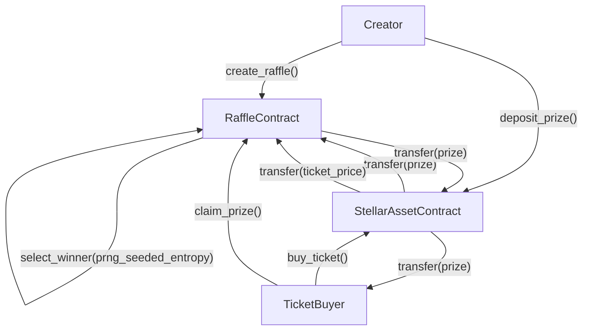

# Tikka - Decentralized Raffle Platform


## 🎯 What is Tikka?

Tikka is a decentralized raffle platform built on Stellar using Soroban smart contracts. Users can create raffles, sell tickets priced in Stellar assets, and distribute prizes securely on-chain.

## 🚀 Key Features

### **🎲 On-Chain Winner Selection**

-   Internal draws use Soroban `env.prng()` with a multi-source seed:
    `timestamp + sequence + raffle_id + tickets_sold`
-   Deterministic replay for identical raffle and ledger inputs
-   Intended for low-stakes raffles; high-stakes draws should use oracle randomness

### **💰 Token-Based Tickets and Prizes**

-   **Ticket Purchases**: Any Stellar asset contract
-   **Prizes**: Same asset used for ticket purchases
-   **Flexible Pricing**: Set ticket prices and prize amount per raffle

### **🔒 Escrowed Prizes**

-   Prizes are held in the smart contract until finalization
-   Winners claim prizes after the raffle ends

### **📊 Basic Raffle Analytics**

-   Total tickets sold per raffle
-   Winner tracking and claim status

## 🏗️ How Tikka Works

### **1. Raffle Creation**

```
Creator → Create Raffle → Set Parameters
```

-   Raffle creators specify:
    -   Description and end time
    -   Maximum ticket count
    -   Ticket price and payment asset
    -   Whether multiple tickets per person are allowed
    -   Prize amount (in the same payment asset)

### **2. Prize Escrow**

```
Creator → Deposit Prize → Contract Escrow
```

-   Prizes are transferred to the smart contract
-   Contract holds the prize until raffle finalization

### **3. Ticket Sales**

```
Participants → Buy Tickets → Contract Validation → Ticket Issuance
```

-   Users purchase tickets with the raffle asset
-   Contract validates payment and issues tickets
-   One ticket equals one entry in the raffle

### **4. Winner Selection**

```
Raffle Ends → Finalize → Select Winner
```

-   Winner is selected from sold tickets
-   Internal mode uses Soroban PRNG seeded with multiple ledger and raffle fields
-   External/oracle mode remains available for stronger trust assumptions

### **5. Prize Distribution**

```
Winner Selected → Claim Prize
```

-   Winners claim their prizes

### **Raffle Flow Diagram**



## 🔧 Technical Architecture

### **Smart Contract Stack**

-   **Soroban (Rust)**: Smart contract implementation
-   **Stellar**: Network and asset contracts

### **Core Contracts**

#### **`contracts/raffle/src/lib.rs`**

```rust
pub fn init_factory(... ) -> Result<(), ContractError>;
pub fn create_raffle(... ) -> Result<Address, ContractError>;
pub fn get_raffles(... ) -> PageResultRaffles;
```

#### **`contracts/raffle-instance/src/lib.rs`**

```rust
pub fn init(... ) -> Result<(), Error>;
pub fn deposit_prize(... ) -> Result<(), Error>;
pub fn buy_tickets(... ) -> Result<u32, Error>;
pub fn finalize_raffle(... ) -> Result<(), Error>;
pub fn provide_randomness(... ) -> Result<(), Error>;
pub fn claim_prize(... ) -> Result<i128, Error>;
pub fn cancel_raffle(... ) -> Result<(), Error>;
pub fn refund_ticket(... ) -> Result<i128, Error>;
pub fn get_raffle(... ) -> Result<Raffle, Error>;
```

### **Data Structures**

```rust
pub struct Raffle {
    pub id: u64,
    pub creator: Address,
    pub description: String,
    pub end_time: u64,
    pub max_tickets: u32,
    pub allow_multiple: bool,
    pub ticket_price: i128,
    pub payment_token: Address,
    pub prize_amount: i128,
    pub tickets_sold: u32,
    pub is_active: bool,
    pub prize_deposited: bool,
    pub prize_claimed: bool,
    pub winner: Option<Address>,
}
```

### **Contract Constraints (Demo)**

-   Only one winner per raffle
-   Prize and ticket payments use the same Stellar asset
-   Internal PRNG is suitable for low-stakes raffles (e.g., sub-500 XLM prizes)
-   For high-stakes raffles, prefer the external oracle/VRF randomness path

## 🔒 Metadata Integrity (metadata_hash)

Every raffle requires a `metadata_hash: BytesN<32>` — a SHA-256 hash of the off-chain metadata JSON stored on IPFS. This hash is committed on-chain at creation and is immutable, so organizers cannot alter the description, image, or rules after tickets are sold.

### Metadata JSON format

```json
{
  "name": "My Raffle",
  "description": "Full rules and description here",
  "image": "ipfs://Qm...",
  "rules": "..."
}
```

### Generating the hash

**Linux / macOS**

```bash
# 1. Create your metadata file
cat > metadata.json << 'EOF'
{"name":"My Raffle","description":"...","image":"ipfs://Qm...","rules":"..."}
EOF

# 2. Hash it (outputs hex)
sha256sum metadata.json
# or on macOS:
shasum -a 256 metadata.json
```

**Node.js**

```js
const crypto = require("crypto");
const fs = require("fs");
const hash = crypto
  .createHash("sha256")
  .update(fs.readFileSync("metadata.json"))
  .digest("hex");
console.log(hash); // 64-char hex string → 32 bytes
```

**Python**

```python
import hashlib, json

meta = {"name": "My Raffle", "description": "...", "image": "ipfs://Qm...", "rules": "..."}
# Use compact, sorted JSON for reproducibility
raw = json.dumps(meta, separators=(',', ':'), sort_keys=True).encode()
print(hashlib.sha256(raw).hexdigest())
```

### Converting hex → `BytesN<32>` for the contract call

```bash
# Stellar CLI example — pass as a hex-encoded bytes argument
stellar contract invoke ... -- \
  --metadata_hash "$(sha256sum metadata.json | cut -d' ' -f1)"
```

> **Important:** Use a canonical JSON serialization (compact, keys sorted) so the hash is reproducible by anyone who downloads the metadata from IPFS.

---


### **Stellar Testnet**

-   **Contract Address**: `CCTCPMI66REXIJQPVOPNTNUZBCMSRM7TZLMIPQROZIID44XNP2P2MKFZ`

## 🚀 Getting Started

### **Prerequisites**

-   Rust toolchain
-   Stellar CLI (optional for deployment)

### **Run Tests**

```bash
cargo test -p raffle-factory
cargo test -p raffle-instance
```

### **Build the Contract**

```bash
cargo build -p raffle-factory
cargo build -p raffle-instance
```

## 🛠️ Development

For local setup, build, and test workflows, see `DEVELOPMENT.md`.

## 🤝 Contributing

See `CONTRIBUTING.md` for contribution guidelines and PR expectations.

## 📚 Documentation

-   **Stellar Soroban**: https://developers.stellar.org/docs/build/smart-contracts/overview
-   **Soroban Examples**: https://github.com/stellar/soroban-examples

## 📄 License

This project is licensed under the MIT License - see the [LICENSE](LICENSE) file for details.

## 🆘 Support

-   **Documentation**: Check our guides
-   **Issues**: Report bugs and feature requests
-   **Community**: Join our Discord for discussions


// protocol_fee_bp: Basis points (1 bp = 0.01%). 
// Must be <= 10_000 (100%). 
// Example: 250 = 2.5%

---

**Built with ❤️ on Stellar**
